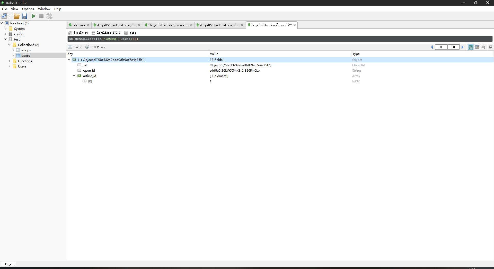
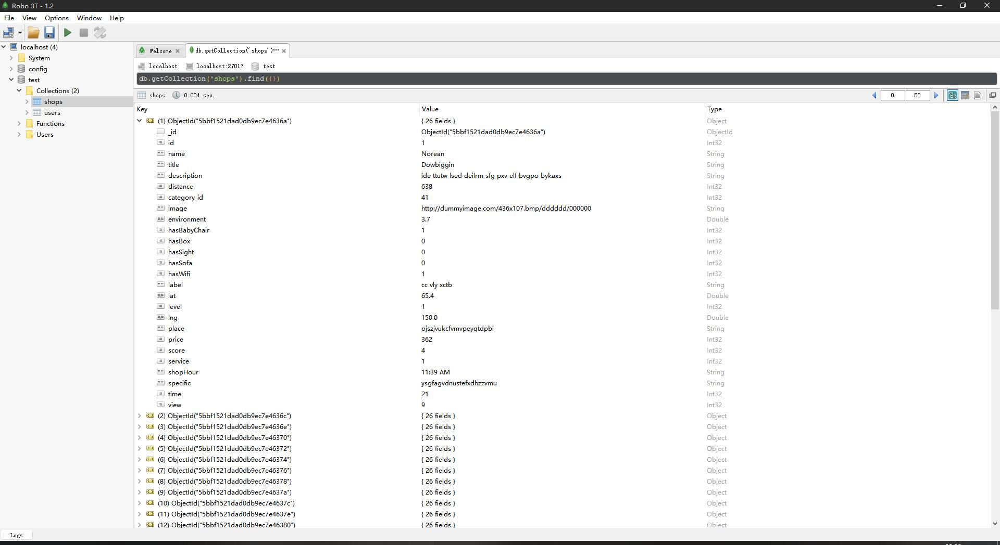
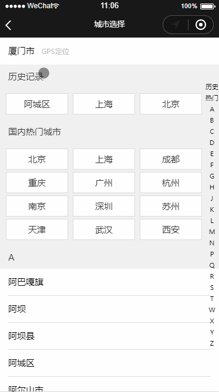

# 美团小程序

## 项目导读

1. 该项目含后端代码，存放于 **server** 文件夹。

2. 后端代码对一些重复性操作进行了抽出公用。`/server/util/util.js`

3. 前端代码所有可能的请求都进行了 **Promise** 化。`/utils/api.js`

4. 前端代码的具体请求进行了封装。`/utils/req.js`

5. 使用了 腾讯地理位置服务。

6. 用户数据结构
    

7. 商铺数据结构:
    

## 效果预览

